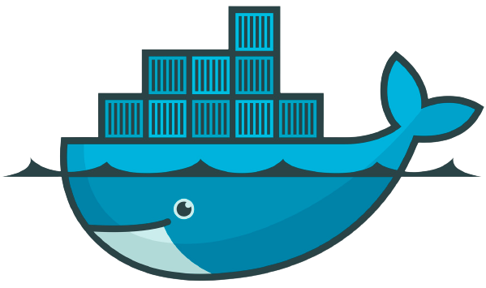
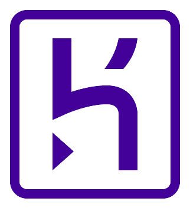
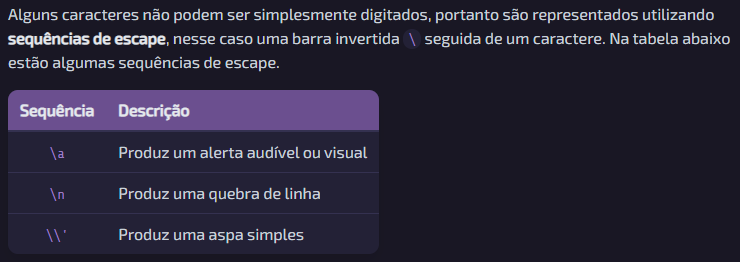
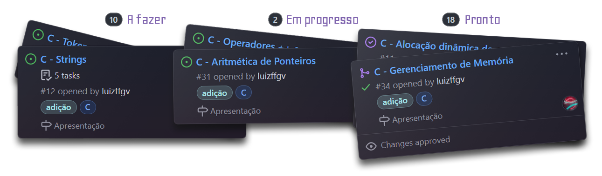
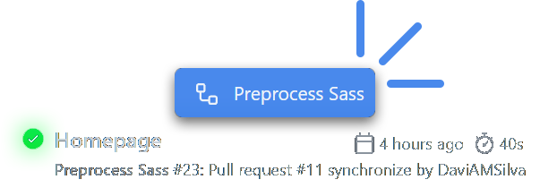

<style scoped>
p {
  animation: fade-in 1s ease 1s 1 normal both;
}

@keyframes fade-in {
  from {
    opacity: 0
  }
  to {
    opacity: 1
  }
}
</style>

# 

Um projeto de estudantes para estudantes

---

## Tecnologias Utilizadas:

<style scoped>
* {
    display: flex;
    flex-flow: row wrap;
    align-self: center;
}

img {
    width: 160px;
    height: auto;
    margin: 15px;
}
</style>



---

## Markdown

A totalidade de conteúdo sobre as linguagens de programação é escrita em Markdown, e a quantidade **total** aproximada de linhas está na tabela abaixo.

| Linguagem  | Linhas |
| ---------- | ------ |
| C          | 2500   |
| JavaScript | 1400   |
| Python     | 600    |
| Assembly   | 0      |

---

### Aqui está um trecho de Markdown

<!-- prettier-ignore -->
```markdown
Alguns caracteres não podem ser simplesmente digitados, portanto são
representados utilizando **sequências de escape**, nesse caso uma barra
invertida `\` seguida de um caractere. Na tabela abaixo estão algumas
sequências de escape.

| Sequência | Descrição                          |
| :-------: | :--------------------------------- |
|   `\a`    | Produz um alerta audível ou visual |
|   `\n`    | Produz uma quebra de linha         |
|   `\\'`   | Produz uma aspa simples            |
```

---

<style scoped>
img {
  width: 100%;
}
</style>

### E aqui está o mesmo trecho exibido em nosso site



---

## Como isso funciona?

---

### 1. Convertemos o Markdown para HTML

Para isso utilizamos nosso conversor escrito em Python, que é um wrapper do módulo Mistune.

---

### 2. Aplicamos os estilos CSS durante a exibição

Como o Markdown é convertido para HTML com as tags apropriadas, basta utilizar seletores CSS para aplicar os estilos.

---


## Organização

Nosso projeto está inteiramente no GitHub, dentro da organização codinStruct.

---

### Repositórios

| Nome                | Função                                      |
| ------------------- | ------------------------------------------- |
| codinStruct         | Tudo que é necessário para rodar o servidor |
| codinStruct-content | Conteúdo sobre linguagens de programação    |
| md2html             | Conversor de Markdown para HTML             |

---

### Kanban

<style scoped>
img {
    width: 100%;
    margin-top: 1em;
}
</style>

Utilizamos GitHub projects para organizar nossos afazeres.



---

### Testes

<style scoped>
img {
    width: 66.6%;
    margin-top: 1em;
}
</style>

Utilizamos GitHub Actions para realizar diversos testes automaticamente em todas nossas alterações significativas.



---

## Webpack

O Webpack compila os códigos-fonte JavaScript e CSS para um formato que pode ser utilizado pelo navegador.

---

Exemplo Webpack antes de ser compilado:

```js
window.$ = require("jquery");
window.p5 = require("p5js/p5.js/p5.min.js");

import "@fortawesome/fontawesome-free/css/fontawesome.min.css";
import "@fortawesome/fontawesome-free/css/solid.min.css";
import "spinkit/spinkit.min.css";
```

---

Exemplo Webpack depois de ser compilado:

```js
/*! For license information please see index.js.LICENSE.txt */
(()=>{var e={7481:(e,t,r)=>{"use strict";r.d(t,{Z:()=>s});var n=r(8081),o=r.n(n),a=r(3645),i=r.n(a)()(o());i.push([e.id,'/*!\n * Font Awesome Free 5.15.4 by @fontawesome - https://fontawesome.'
```

---

## Backend

Nosso backend utiliza o framework Express.js para gerenciar as requisições e uma API RESTful utilizada para acessar os dados no frontend.

---

## Estrutura

<style scoped>
li {
  margin: -15px;
}

ul {
  padding-left: 100px;
}
</style>

- codinStruct-content/
- md2html/
- frontend/
  - 404/
  - conteudo/
  - icons/
  - js/
  - styles/
  - webpack/
  - content/
- routes/
- webpack/
- node_modules/

---

### Rotas

<!-- Por algum motivo meu Prettier odeia essa tabela -->
<!-- prettier-ignore -->
| Rota              | Utilização                                                        |
| ----------------- | ----------------------------------------------------------------- |
| /api/content      | Retorna o conteúdo html de uma página                             |
| /api/sidebar      | Retorna um JSON com os dados necessários para construir a sidebar |
| /api/descriptions | Retorna um JSON com as descrições de todas as linguagens          |

---

## Docker

Docker é uma ferramenta de gerenciamento de contêineres para execução de códigos-fonte em um ambiente de desenvolvimento.  
Nós o utilizamos para executar nosso back-end em um ambiente de testes.

---

### Dockerfile

<style scoped>
* {
  font-size: 0.8em;
  line-height: 0.8em;
}
</style>

```dockerfile
FROM ubuntu

WORKDIR /usr/src/codinStruct
RUN apt-get update
RUN apt-get install -y nodejs
RUN apt-get install -y npm
RUN apt-get install -y python3
RUN apt-get install -y python3-pip

COPY package*.json ./
RUN npm install

COPY md2html/requirements.txt md2html/
RUN pip3 install -r md2html/requirements.txt

COPY . .

# Saves the built files to the image so they don't have to be built again
# every time Heroku stops the app because it was idle and has to start it again
RUN npm run build

CMD ["npm","start"]
```

---

## Heroku

O Heroku é um serviço de hospedagem de aplicações web gratuito e de fácil uso.

Para fazer o upload da nossa aplicação é utilizado o Container Registry & Runtime, fazendo o upload da imagem Docker para o Heroku.

<br>

codinstruct-pi4.herokuapp.com

---

## Agradecemos a atenção

<style scoped>
img {
  animation-name: wave-animation;
  animation-duration: 2.5s;
  animation-iteration-count: infinite;
  transform-origin: 70% 70%;
  margin-top: 1em;
}

@keyframes wave-animation {
    0% { transform: rotate(0.0deg) }
   10% { transform: rotate(14.0deg) }
   20% { transform: rotate(-8.0deg) }
   30% { transform: rotate(14.0deg) }
   40% { transform: rotate(-4.0deg) }
   50% { transform: rotate(10.0deg) }
   60%, 100% { transform: rotate(0.0deg) }
}
</style>


