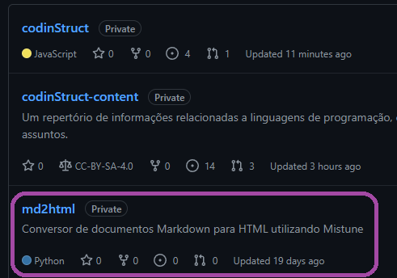

# 

---

## Tecnologias Utilizadas:

<style scoped>
* {
    display: flex;
    flex-flow: row wrap;
    align-self: center;
}

img {
    width: 160px;
    height: auto;
    margin: 15px;
}
</style>


---

## Markdown

A totalidade de conteúdo sobre as linguagens de programação é escrita em Markdown, e a quantidade **total** aproximada de linhas está na tabela abaixo.

| Linguagem  | Linhas |
| ---------- | ------ |
| C          | 2500   |
| JavaScript | 1400   |

---

### Aqui está um trecho de Markdown

```markdown
Alguns caracteres não podem ser simplesmente digitados, portanto são
representados utilizando **sequências de escape**, nesse caso uma barra
invertida `\` seguida de um caractere. Na tabela abaixo estão algumas
sequências de escape.

| Sequência | Descrição                          |
| :-------: | :--------------------------------- |
|   `\a`    | Produz um alerta audível ou visual |
|   `\n`    | Produz uma quebra de linha         |
|   `\\'`   | Produz uma aspa simples            |
```

---

### E aqui está o mesmo trecho exibido em nosso site


---

## Como isso funciona?

---

### 1. Convertemos o Markdown para HTML

Para isso utilizamos nosso conversor escrito em Python, que é um wrapper do módulo Mistune. 

---

### 2. Aplicamos os estilos CSS durante a exibição

Como o Markdown é convertido para HTML com as tags apropriadas, basta utilizar seletores CSS para aplicar os estilos.

---

## Webpack

O Webpack compila os códigos-fonte JavaScript e CSS para um formato que pode ser utilizado pelo navegador.

---

Exemplo Webpack antes de ser compilado:

```js
window.$ = require("jquery");
window.p5 = require("p5js/p5.js/p5.min.js");

import "@fortawesome/fontawesome-free/css/fontawesome.min.css";
import "@fortawesome/fontawesome-free/css/solid.min.css";
import "spinkit/spinkit.min.css";
```

---

Exemplo Webpack depois de ser compilado:

```js
/*! For license information please see index.js.LICENSE.txt */
(()=>{var e={7481:(e,t,r)=>{"use strict";r.d(t,{Z:()=>s});var n=r(8081),o=r.n(n),a=r(3645),i=r.n(a)()(o());i.push([e.id,'/*!\n * Font Awesome Free 5.15.4 by @fontawesome - https://fontawesome.'
```

---

## Backend

Nosso backend utiliza o framework Express.js para gerenciar as requisições e uma API RESTful utilizada para acessar os dados no frontend.

---

## Estrutura
<style scoped>
li {
  margin: -15px;
}

ul {
  padding-left: 100px;
}
</style>

- codinStruct-content/
- md2html/
- frontend/
  - 404/ 
  - conteudo/
  - icons/
  - js/
  - styles/
  - webpack/
  - content/
- routes/
- webpack/
- node_modules/

---

### Rotas

| Rota              | Utilização                                                        |
| ----------------- | ----------------------------------------------------------------- |
| /api/content      | Retorna o conteúdo html de uma página                             |
| /api/sidebar      | Retorna um JSON com os dados necessários para construir a sidebar |
| /api/descriptions | Retorna um JSON com as descrições de todas as linguagens          |
